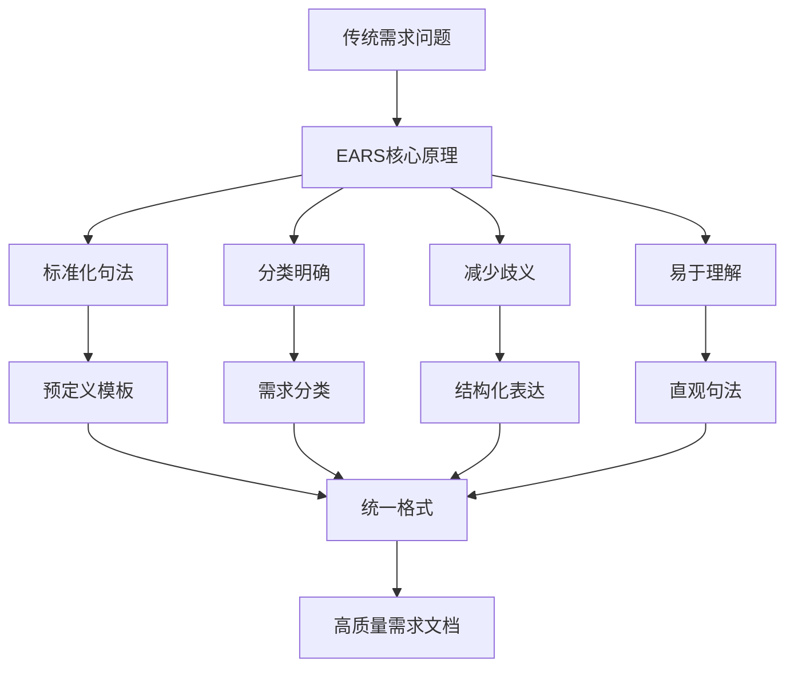
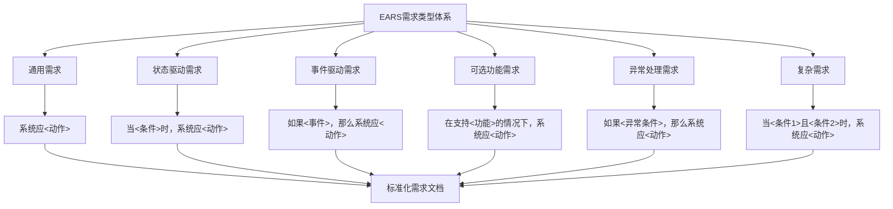
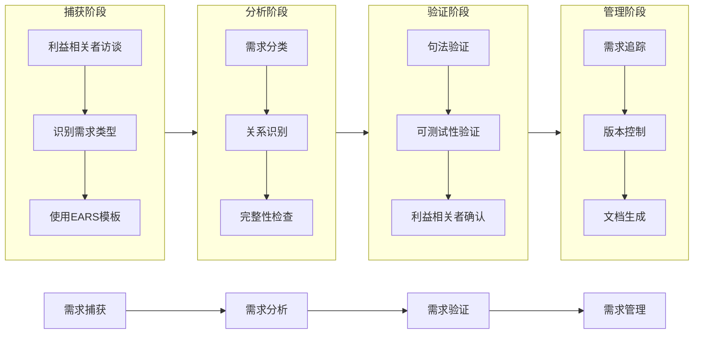
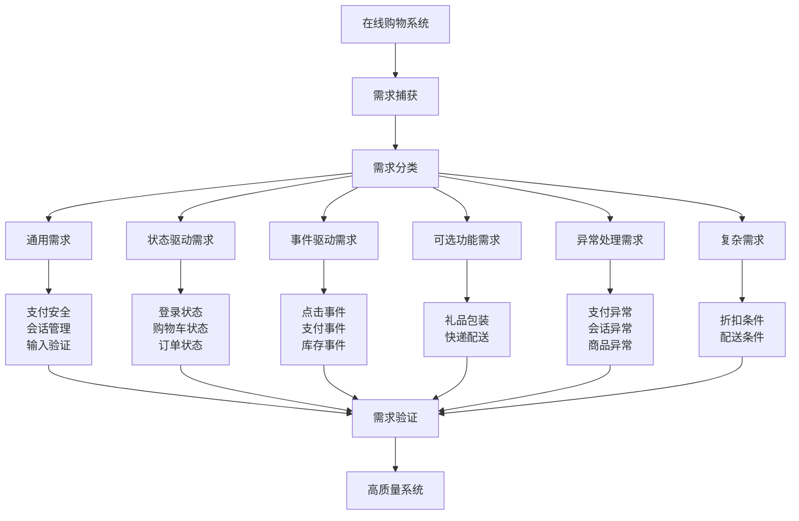
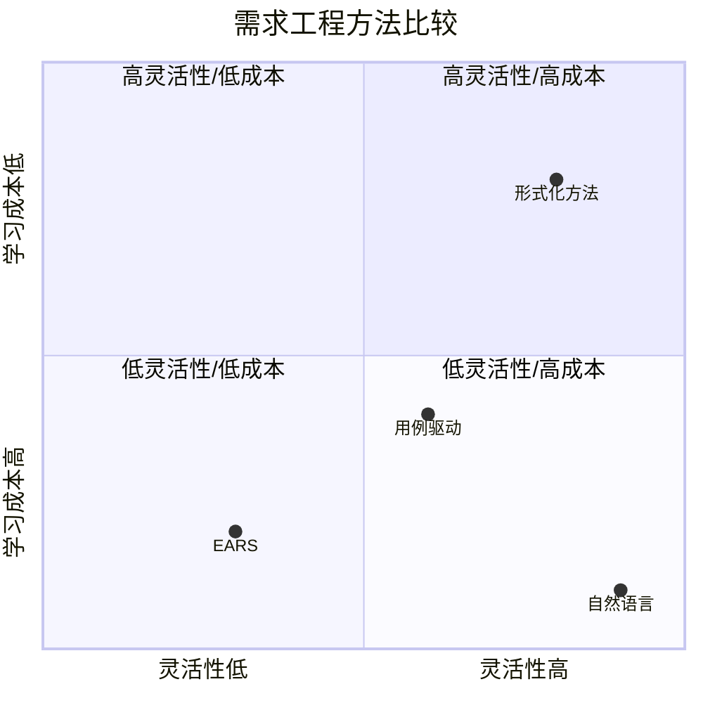
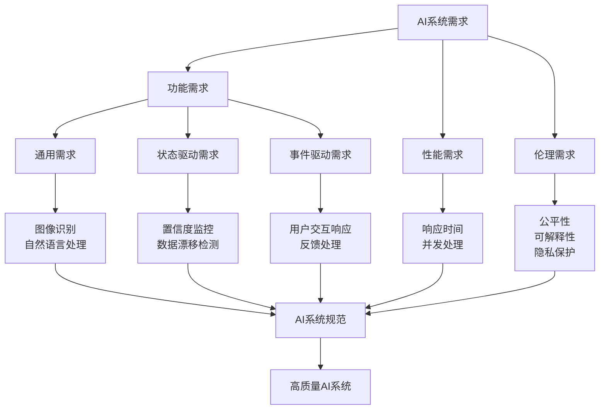
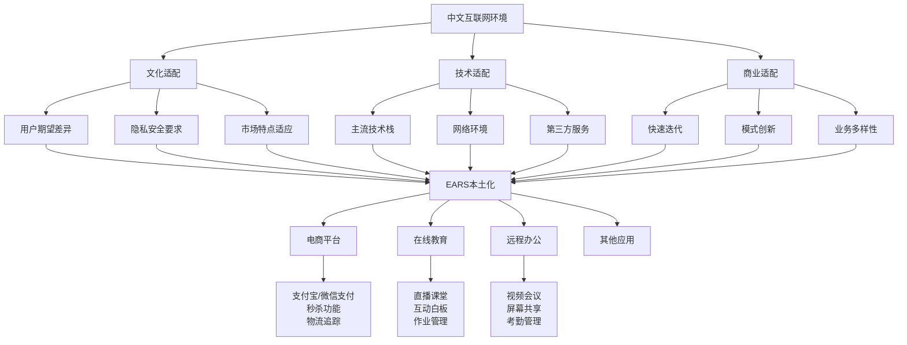
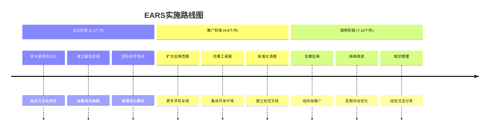
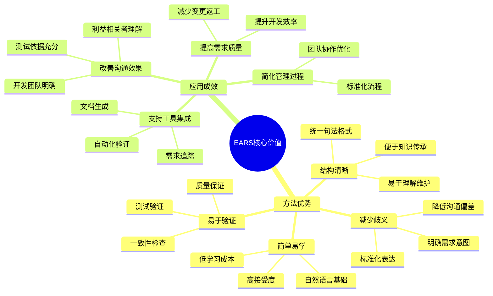

EARS（Easy Approach to Requirements Syntax，简易需求句法方法）是一种轻量级、实用的需求工程方法，通过标准化的句法模板有效解决传统需求工程中的关键问题。本文将全面介绍EARS方法的理论基础、实践应用以及在现代软件开发中的价值。

<!-- more -->

## EARS 方法概述

### 基本概念

EARS 是一种用于改进需求工程实践的结构化方法，通过提供标准化的需求描述句法，帮助团队更有效地捕获、记录和管理软件系统的需求。

### 发展背景

传统需求工程方法面临以下挑战：
- **需求表述不清晰**：自然语言描述存在歧义，导致理解不一致
- **需求结构不规范**：缺乏统一格式标准，难以分析和验证  
- **需求捕获困难**：利益相关者难以准确表达真实需求
- **需求管理复杂**：需求间关系难以追踪和维护

### 核心原理

EARS 基于以下核心原理：
1. **标准化句法**：使用预定义句法模板描述不同类型需求
2. **分类明确**：将需求分类，每种类型有特定描述格式
3. **减少歧义**：结构化表达减少自然语言模糊性
4. **易于理解**：简单直观句法，便于所有利益相关者理解



## EARS 需求类型与句法规范

### 1. 通用需求（Ubiquitous Requirements）
描述系统始终需要满足的基本条件。

**句法格式**：`系统应<动作>`

**示例**：
- 系统应提供用户身份验证功能
- 系统应保持数据完整性

### 2. 状态驱动需求（State-driven Requirements）
描述系统在特定状态下应该执行的操作。

**句法格式**：`当<条件>时，系统应<动作>`

**示例**：
- 当用户已登录时，系统应显示用户仪表板
- 当电池电量低时，系统应进入省电模式

### 3. 事件驱动需求（Event-driven Requirements）
描述系统对特定事件的响应。

**句法格式**：`如果<事件>，那么系统应<动作>`

**示例**：
- 如果用户点击提交按钮，那么系统应验证表单
- 如果系统检测到错误，那么系统应记录错误详情

### 4. 可选功能需求（Optional Feature Requirements）
描述系统的可选功能。

**句法格式**：`在支持<功能>的情况下，系统应<动作>`

**示例**：
- 在支持多语言的情况下，系统应允许语言切换
- 在支持生物识别认证的情况下，系统应提供指纹登录

### 5. 异常处理需求（Exception Handling Requirements）
描述系统如何处理异常情况。

**句法格式**：`如果<异常条件>，那么系统应<动作>`

**示例**：
- 如果数据库连接失败，那么系统应显示错误消息
- 如果提供了无效凭据，那么系统应拒绝访问

### 6. 复杂需求（Complex Requirements）
描述需要多个条件组合的复杂场景。

**句法格式**：`当<条件1>且<条件2>时，系统应<动作>`

**示例**：
- 当用户具有管理员权限且系统处于维护模式时，系统应允许系统配置更改



## EARS 方法应用实践

### 需求工程流程集成

#### 1. 需求捕获阶段
- 与利益相关者访谈，识别需求类型
- 使用相应EARS句法模板记录需求
- 确保每个需求有明确类型和结构

#### 2. 需求分析阶段
- 按需求类型分类整理
- 识别需求间关系和依赖性
- 检查需求完整性和一致性

#### 3. 需求验证阶段
- 使用句法规则验证需求格式正确性
- 确保每个需求可测试
- 与利益相关者确认需求准确性

#### 4. 需求管理阶段
- 使用标准化格式便于需求追踪
- 支持需求版本控制和变更管理
- 便于生成需求文档和报告



### 应用示例：在线购物系统



#### 通用需求
```
系统应提供安全的支付处理功能
系统应维护用户会话信息
系统应验证用户输入
```

#### 状态驱动需求
```
当用户已登录时，系统应显示个性化推荐
当购物车包含商品时，系统应计算总价
当订单确认时，系统应发送确认邮件
```

#### 事件驱动需求
```
如果用户点击"加入购物车"按钮，那么系统应将商品添加到购物车
如果支付成功，那么系统应创建订单记录
如果库存不足，那么系统应显示缺货消息
```

#### 可选功能需求
```
在支持礼品包装服务的情况下，系统应允许定制礼品消息
在支持快递配送的情况下，系统应提供配送时间预估
```

#### 异常处理需求
```
如果支付网关不可用，那么系统应将支付加入重试队列
如果用户会话过期，那么系统应保存购物车内容
如果商品代码无效，那么系统应显示错误消息
```

#### 复杂需求
```
当订单总额超过100元且用户是会员时，系统应提供10%折扣
当配送地址是国际地址且商品包含限制物品时，系统应显示海关信息
```

### 需求验证与质量保证

使用EARS方法捕获的需求可进行系统化验证：

1. **句法验证**：检查每个需求是否符合相应句法格式
2. **完整性验证**：确保所有需求类型都被覆盖
3. **一致性验证**：检查需求间是否存在冲突
4. **可测试性验证**：确保每个需求都可被测试

## EARS 方法评估与分析

### 优势分析

#### 1. 提高需求质量
- **减少歧义**：标准化句法减少理解偏差
- **增强一致性**：统一格式使需求文档更规范
- **改善完整性**：通过类型分类确保各类需求被考虑

#### 2. 简化需求工程过程
- **易于学习**：简单句法模板容易掌握
- **提高效率**：标准化格式加快需求捕获速度
- **便于维护**：结构化需求更容易管理和修改

#### 3. 改善沟通效果
- **利益相关者理解**：简单语言便于非技术人员理解
- **开发团队明确**：清晰需求描述减少开发疑问
- **测试依据充分**：结构化需求提供明确测试标准

#### 4. 支持工具集成
- **自动化验证**：可开发工具自动检查句法正确性
- **需求追踪**：标准化格式便于建立需求追踪矩阵
- **文档生成**：可自动生成标准化需求文档

### 局限性与挑战

#### 1. 灵活性限制
- **表达约束**：固定句法格式可能无法表达复杂业务逻辑
- **语言局限**：某些特殊领域需求可能不够灵活
- **创造性限制**：过于标准化格式可能限制需求创新表达

#### 2. 学习成本
- **初期投入**：团队需要时间学习和适应新方法
- **培训需求**：需要对团队成员进行专门EARS培训
- **习惯改变**：从自然语言转换到结构化表达需要适应期

#### 3. 适用范围限制
- **简单项目过度设计**：对于简单项目可能显得过于复杂
- **非功能需求挑战**：某些非功能需求难以用标准句法表达
- **领域特殊性**：某些特定领域可能需要定制化扩展

#### 4. 工具支持不足
- **工具生态不完善**：相比其他需求工程方法，专用工具较少
- **集成挑战**：与现有开发工具链集成可能需要额外工作
- **自动化程度**：目前的自动化支持还不够成熟

### 与其他需求工程方法的比较



#### EARS vs 传统自然语言
- **优势**：更少的歧义、更好的结构、更容易验证
- **劣势**：灵活性较低、需要学习成本

#### EARS vs 用例驱动方法
- **优势**：更细粒度、更容易追踪、更适合详细规格说明
- **劣势**：不如用例直观、难以表达复杂的交互场景

#### EARS vs 形式化方法
- **优势**：更容易理解、更低的入门门槛、更好的实用性
- **劣势**：不如形式化方法严谨、难以进行数学验证

## EARS 在现代技术领域的应用

### EARS 在AI编程中的应用

#### AI编程的特殊需求挑战

人工智能编程与传统软件开发相比，具有独特的需求捕获挑战：
- **不确定性**：AI系统的行为可能具有概率性和不可预测性
- **数据依赖性**：AI模型的性能高度依赖于训练数据的质量和数量
- **持续学习**：AI系统需要适应新数据和变化的环境
- **伦理和偏见**：需要确保AI系统的公平性和无偏见性

#### EARS在AI需求捕获中的优势



**规范化AI功能需求**
```
# 通用需求（AI模型功能）
系统应提供图像识别功能，准确率达到95%以上
系统应支持自然语言处理，理解用户意图的准确率不低于90%

# 状态驱动需求（模型状态相关）
当模型置信度低于80%时，系统应请求人工确认
当检测到数据漂移时，系统应触发模型重训练

# 事件驱动需求（用户交互触发）
如果用户上传新图片，那么系统应在3秒内返回识别结果
如果用户反馈预测错误，那么系统应记录并用于模型改进
```

**规范化AI性能与伦理需求**
```
# 性能指标需求
系统应在100毫秒内完成单次预测
系统应支持每秒处理1000个并发请求

# 公平性需求
系统应确保对不同性别、年龄、种族群体的预测准确率差异不超过5%
系统应提供算法决策的可解释性说明

# 隐私保护需求
如果处理个人敏感信息，那么系统应进行数据脱敏
如果用户要求删除数据，那么系统应在24小时内完成
```

#### AI编程实践案例

**智能客服系统**
```
# 通用需求
系统应提供7×24小时自动客服服务
系统应支持多轮对话理解

# 状态驱动需求
当用户情绪检测为愤怒时，系统应转接人工客服
当置信度低于85%时，系统应提供备选答案

# 事件驱动需求
如果用户输入包含敏感词汇，那么系统应进行内容过滤
如果用户满意度评分低于3分，那么系统应记录改进点
```

**智能推荐系统**
```
# 通用需求
系统应基于用户行为历史提供个性化推荐
系统应支持实时推荐更新

# 复杂需求
当用户浏览历史显示对科技产品感兴趣且当前时间为工作日时，系统应优先推荐工作效率工具
当用户在过去7天内购买过婴儿用品且浏览时长超过5分钟时，系统应推荐相关育儿产品
```

#### AI应用最佳实践与挑战

**最佳实践**
- 结合MLOps流程，将EARS需求与模型版本管理结合
- 建立数据驱动的需求验证机制
- 实施人机协作的需求管理模式
- 规范化AI系统的可解释性要求

**主要挑战与解决方案**
- **不确定性管理**：引入置信度区间和统计指标
- **持续学习需求**：规范化学习触发条件和更新策略
- **伦理和偏见**：建立持续监控和纠正机制

### 中文互联网环境应用



#### 本土化适配要点

**文化差异考虑**
- 中文用户对产品功能的期望与西方用户不同
- 需要考虑中国用户对隐私、安全、便利性的特殊要求
- 适应快速变化的中国互联网市场特点

**技术环境适配**
- 考虑国内主流技术栈和平台（微信小程序、支付宝生态等）
- 适应中国特色的网络环境和技术限制
- 集成国内常用的第三方服务和API

**商业模式创新**
- 中国互联网商业模式创新速度快，需求变化频繁
- EARS的灵活性需要适应快速迭代的产品开发模式
- 考虑直播电商、社交电商等新型业务模式的需求特点

#### 中文互联网应用示例

**电商平台（淘宝、京东等）**
```
# 通用需求
系统应支持多种支付方式，包括支付宝和微信支付
系统应提供实时库存管理

# 状态驱动需求
当用户在秒杀期间添加商品到购物车时，系统应为商品保留库存15分钟
当商家确认发货时，系统应将订单状态更新为"运输中"

# 复杂需求
当订单总额超过299元且用户有有效优惠券时，系统应应用免运费和优惠券折扣
```

**在线教育平台（学而思、猿辅导等）**
```
# 通用需求
系统应支持多达1000名学生的直播课堂
系统应提供互动白板功能

# 事件驱动需求
如果学生提交作业，那么系统应通知老师并生成评分提醒
如果直播课堂期间网络延迟超过500毫秒，那么系统应切换到低带宽模式
```

**远程办公软件（钉钉、企业微信等）**
```
# 通用需求
系统应支持多达300名参与者的视频会议
系统应提供屏幕共享和远程控制功能

# 复杂需求
当会议正在录制且参与者来自多个时区时，系统应使用每个参与者的本地时间戳记录
```

## EARS 实施指南

### 组织级实施策略



**渐进式采用路径**
- 从非关键项目开始试点，验证方法有效性
- 逐步扩大应用范围，建立成功案例和最佳实践
- 定期评估应用效果，持续优化实施策略

**团队能力建设**
- 组织EARS方法培训，确保团队掌握核心概念
- 建立需求编写规范，统一团队理解和应用标准
- 定期进行经验分享，促进知识传播和方法改进

**工具链集成**
- 选择合适的建模工具，支持需求可视化和管理
- 建立完整的需求管理流程，覆盖需求全生命周期
- 集成开发和测试环境，实现需求追踪和验证

### 项目级应用实践

**需求捕获阶段**
- 识别关键利益相关者，确保需求来源的全面性
- 使用EARS模板引导需求讨论，提高需求捕获效率
- 建立需求优先级评估机制，聚焦核心价值功能

**需求分析阶段**
- 进行需求一致性检查，消除冲突和冗余
- 评估需求可行性和风险，制定应对策略
- 建立需求追踪矩阵，确保需求覆盖完整性

**需求验证阶段**
- 制定需求验证计划，明确验证标准和方法
- 执行需求评审和测试，确保需求质量
- 建立需求变更控制机制，管理需求演化

### 持续改进机制

**效果评估体系**
- 建立量化评估指标，测量EARS应用效果
- 定期收集团队反馈，识别改进机会
- 对比分析实施前后差异，验证方法价值

**知识管理体系**
- 建立EARS最佳实践库，沉淀组织经验
- 定期更新方法指南，反映最新实践成果
- 促进跨项目知识共享，避免重复试错

## 总结与展望

### EARS核心价值总结



EARS（Easy Approach to Requirements Syntax）通过结构化的自然语言表达，为需求工程领域带来了显著价值：

**方法优势**
- **简单易学**：基于自然语言，学习成本低，团队接受度高
- **结构清晰**：统一的句法格式，便于理解、维护和传承
- **减少歧义**：标准化的表达方式，有效降低沟通偏差
- **易于验证**：结构化的需求更容易进行一致性检查和测试验证

**应用成效**
- 提高需求质量，减少后期变更和返工
- 简化需求管理过程，提升团队工作效率
- 改善利益相关者沟通，增强需求理解一致性
- 支持工具集成，实现需求工程自动化

### 未来发展趋势

**技术融合方向**
- 与人工智能结合，实现智能化需求分析和验证
- 集成大数据分析，支持数据驱动的需求决策
- 融合敏捷和DevOps方法，适应快速迭代开发模式

**应用领域扩展**
- 在物联网、区块链等新兴技术领域的应用探索
- 扩展至产品管理、用户体验等非功能性需求领域
- 支持跨文化、跨语言的国际项目需求管理

**方法演进路径**
- 持续优化句法结构，提升表达能力和灵活性
- 开发更完善的工具支持，实现需求工程全自动化
- 建立行业标准，推动EARS方法的广泛应用和认可

### 实践建议

对于希望采用EARS方法的组织，建议：

1. **从小规模试点开始**，选择适合的项目验证方法有效性
2. **重视团队培训**，确保正确理解和应用EARS核心概念
3. **建立支持环境**，选择合适的工具并集成现有开发流程
4. **持续改进优化**，根据实践经验调整和完善应用方式

随着软件开发复杂度的不断提升，EARS方法将在需求工程领域发挥越来越重要的作用，帮助团队更好地应对现代软件开发的挑战，实现高质量的需求管理。
