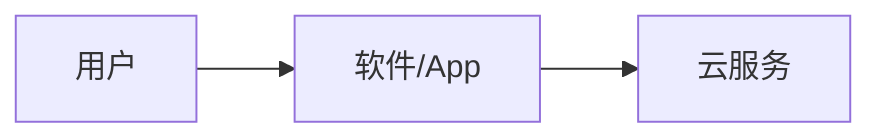
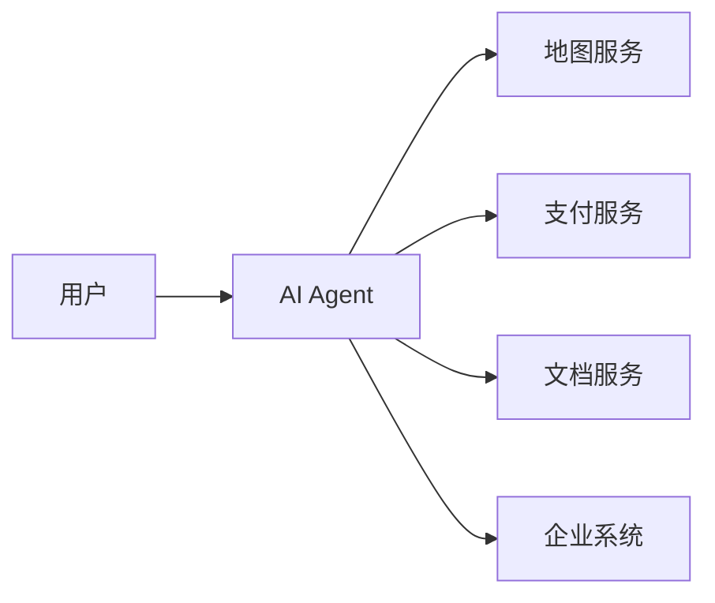
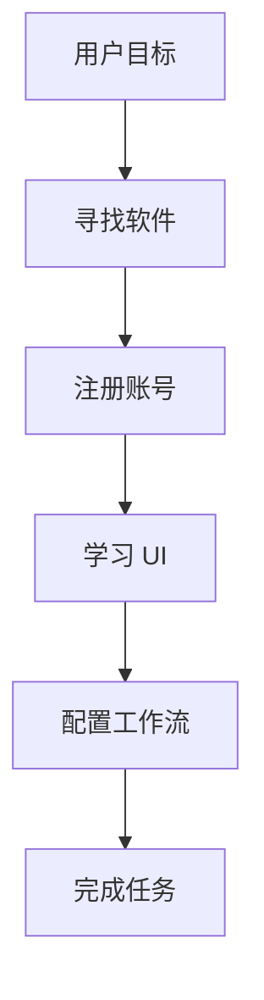
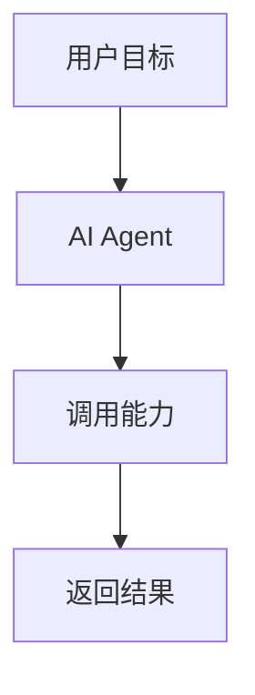
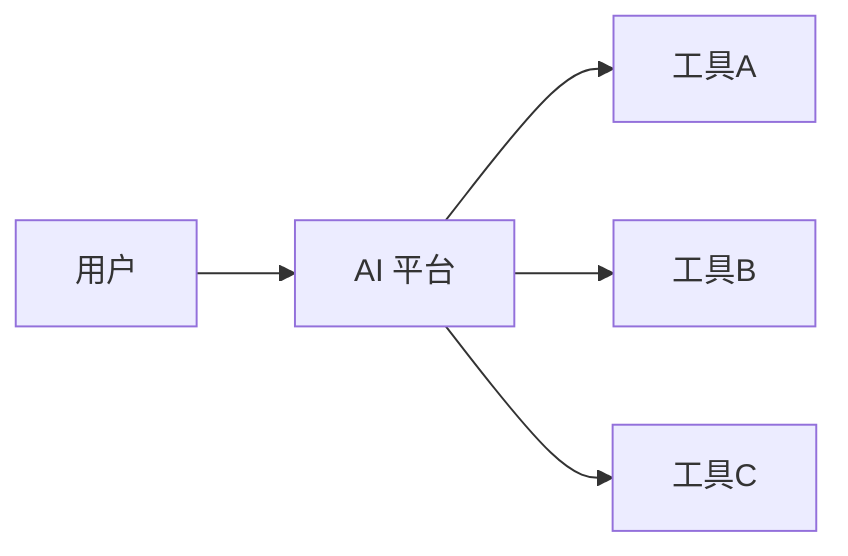
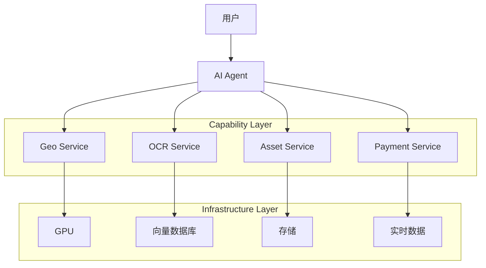

***

layout: post
title:  AI 时代的软件收费模式：从 SaaS 到 Agent Economy
date:   2026-05-01 13:46:04 +0800
categories: talk
tag: \[talk]
------------

过去二十年，软件行业的核心商业模式一直很稳定：

> 用户购买软件，软件提供功能。

无论是桌面时代、移动互联网时代，还是 SaaS 时代，本质都没有改变：

```text
用户 → 软件 → 服务
```

但 AI 的出现，正在改变整个链路。

<!-- more --> 

未来，用户可能不再直接使用软件，而是：

> 用户订阅 AI，通过 AI 调用各种第三方能力。

软件不再是“用户操作的工具”，而是：

> 被 AI 调用的能力模块（Capability）。

这意味着：

- 软件的形态会变化
- 收费方式会变化
- 平台关系会变化
- “谁掌握用户入口”也会变化

本文尝试系统性地讨论：

1. AI 时代的软件结构会如何演化
2. 为什么传统 SaaS 会被冲击
3. 新的收费模式会是什么
4. 哪些软件会被 AI 吞掉
5. 哪些方向反而会更值钱

***

# 一、软件行业正在发生结构性变化

## Web / SaaS 时代

过去的软件结构：



软件既负责：

- UI
- 工作流
- 用户交互
- 能力封装

用户需要：

- 学习软件
- 购买软件
- 在多个软件间切换

因此形成了 SaaS 订阅制：

- Notion
- Slack
- Jira
- Figma
- Zoom

每个软件都是一个独立入口。

***

# 二、AI 正在成为新的入口层

AI 出现之后，结构开始变化：



用户不再直接操作软件。

而是：

> 告诉 AI 自己想做什么。

例如：

- “帮我整理会议纪要”
- “帮我订一家适合亲子的餐厅”
- “帮我生成本周销售分析”
- “帮我创建一个营销页面”

AI 负责：

- 理解意图
- 选择工具
- 编排工作流
- 调用第三方能力

软件开始从：

```text
Human Interface
```

变成：

```text
Agent Capability
```

***

# 三、软件会从“产品”退化成“能力”

这是最重要的变化。

未来很多软件不再需要完整 UI。

它们只需要：

- API
- Tool Schema
- MCP Server
- SDK
- Agent Interface

即可被 AI 调用。

***

## 传统软件

```text
用户 → 打开 App → 点击按钮 → 完成任务
```

***

## AI 时代

```text
用户 → 告诉 AI → AI 调用能力 → 返回结果
```

***

## 软件的价值重心会变化

过去：

| 价值来源 | 说明     |
| ---- | ------ |
| UI   | 用户操作体验 |
| 增长   | 获取用户   |
| 工作流  | 页面设计   |

未来：

| 价值来源   | 说明          |
| ------ | ----------- |
| API 能力 | 是否容易被 AI 调用 |
| 数据     | 是否拥有真实数据    |
| 实时性    | 是否能提供实时能力   |
| 专业能力   | 是否难以被模型内化   |

***

# 四、为什么传统 SaaS 会被冲击

SaaS 的核心逻辑是：

> “一个用户 / 团队使用一个工具。”

但 AI 会改变这一点。

未来用户更可能：

> “订阅一个 AI，然后由 AI 动态调用多个能力。”

这意味着：

- 用户不愿意维护大量订阅
- 用户不愿意学习复杂 UI
- 用户更愿意直接描述目标

***

## SaaS 的问题开始暴露



流程太长。

***

## AI Agent 的流程



用户甚至不知道：

- 使用了哪个 API
- 调用了哪个系统
- 数据来自哪里

***

# 五、未来的软件收费方式会怎样变化

很多人会自然想到：

> “用户向 AI 付费，AI 再向第三方结算。”

这个方向是对的，但不会只有一种收费模型。

未来更可能是“混合收费体系”。

***

# 六、未来最可能的五层收费结构

## 1. AI 基础订阅费

类似：

- ChatGPT Plus
- Claude Max
- Gemini Ultra

用户买的是：

- 更强模型
- 更长上下文
- 更快响应
- Agent 能力

这是：

```text
AI Operating System Fee
```

***

# 2. Usage-Based（按调用量）

这一层会非常普遍。

但不会只有 Token。

未来更可能按：

| 类型   | 计费方式   |
| ---- | ------ |
| OCR  | 每千页    |
| 地图   | 每千次请求  |
| 图像生成 | 每张     |
| 视频生成 | 每分钟    |
| 工作流  | 每次任务   |
| GPU  | 每秒计算时间 |

***

# 3. Outcome-Based（按结果收费）

这是 AI 时代非常重要的新模式。

AI 不再卖“过程”。

而是卖：

> “结果”。

例如：

- AI 帮你找到客户 → 收佣金
- AI 帮你完成销售 → 分成
- AI 帮你降低成本 → 收益共享

未来很多 AI 公司会从：

```text
Software Company
```

变成：

```text
Revenue Partner
```

***

# 4. 基础设施收费

AI 应用本身未必最赚钱。

真正赚钱的可能是：

- GPU
- 向量数据库
- 实时数据
- 地理能力
- Agent Runtime
- 身份系统

类似 Web 时代：

> 最赚钱的是云计算，而不是博客系统。

***

# 5. Agent Marketplace 抽成

未来一定会出现：

- Agent Store
- Tool Marketplace
- MCP Marketplace

结构类似：



AI 平台负责：

- 流量分发
- Tool 调度
- 结算
- 抽佣

这会像：

- App Store
- 微信小程序
- Steam

但比它们更强。

因为 AI 掌握：

> “决策权”。

***

# 七、哪些软件会被 AI 吞掉

## 高风险领域

### 1. UI 很重，但能力很弱的软件

例如：

- 简单 CMS
- 基础 BI
- 表单系统
- 基础客服
- 内容生成工具

因为：

> AI 可以直接生成。

***

## 中风险领域

### 2. 工作流型 SaaS

例如：

- 项目管理
- 协同工具
- 自动化平台

AI 会逐步接管大量操作。

***

# 八、哪些方向反而更值钱

## 1. 拥有真实世界资源的服务

例如：

- 地图
- 支付
- 酒店
- 物流
- 打车
- 外卖

AI 无法凭空创造这些能力。

***

## 2. 拥有私有数据的系统

例如：

- ERP
- CRM
- 企业知识库

***

## 3. Agent-Friendly 基础能力

未来更有价值的可能不是 App。

而是：

```text
Machine Callable Capability
```

例如：

- Geo API
- Asset API
- OCR API
- Region API
- Identity API
- Workflow Runtime

***

# 九、未来的软件结构（可能形态）

未来的软件结构，很可能会变成：



***

# 十、最终结论

AI 不只是一个聊天工具。

它更像：

> 下一代操作系统。

而软件行业正在发生一次新的分层：

| 时代    | 核心入口  |
| ----- | ----- |
| Web   | 浏览器   |
| 移动互联网 | App   |
| AI 时代 | Agent |

未来大量软件会从：

```text
面向用户的软件
```

变成：

```text
面向 AI 的能力服务
```

因此：

- UI 的重要性会下降
- API 的重要性会上升
- 工作流会被 Agent 接管
- 收费模式会从“订阅软件”变成“购买能力”

最终形成：

```text
用户 → AI Agent → 能力服务 → 基础设施
```

而真正长期值钱的，将不再只是 App。

而是：

> 能够被 AI 调用、编排、组合的基础能力。

